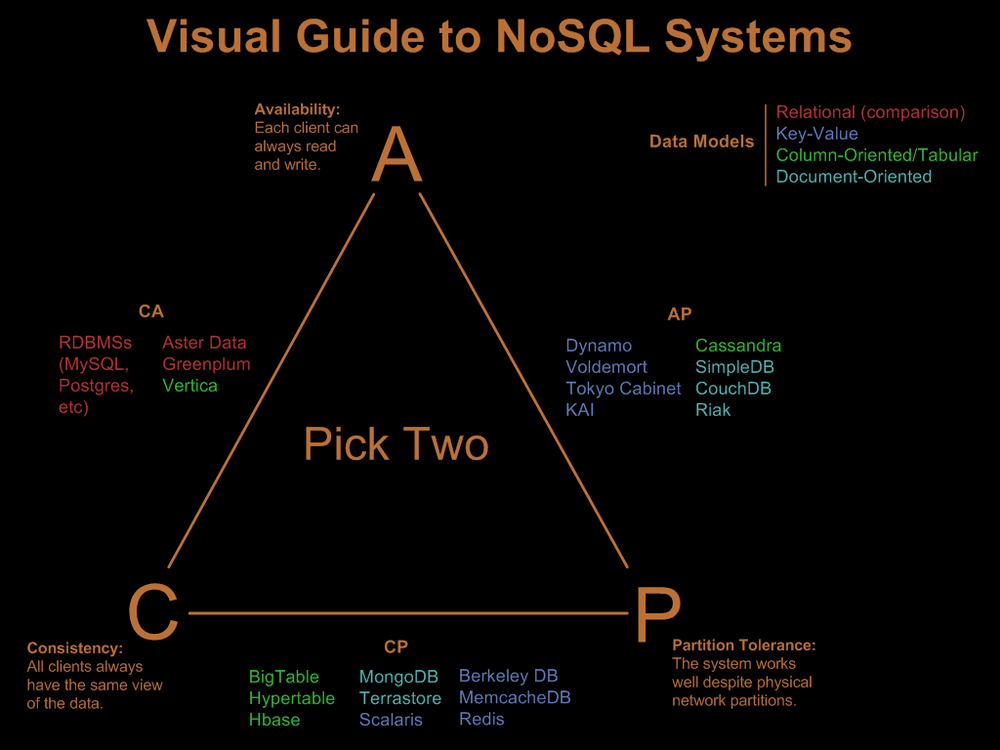

# CAP Teoremi Nedir?

CAP teoremi özellikle dağıtık (distributed) sistemlerle uğraşanların aşina olduğu bir terimdir. CAP teoremi, dağıtık bir sistemin aynı anda tutarlılık (consistency), ulaşılabilirlik (availability) ve bölünebilme toleransı (partition tolerance) koşullarına aynı anda sahip olamayacağını söyler. Yani bunlardan sadece ikisini tercih etmek durumundasınız. Teorem, ilk olarak 1998 yılında California üniversitesinde bilgisayar bilimcisi Eric Brewer tarafından ortaya atılmıştır. Bu nedenler aynı zamanda Brewer teoremi olarak da bilinir.

## Bölüm 1. “Remembrance Inc”, yeni girişiminiz

Dün akşam eşiniz sizin onun doğum gününü hatırlamanız ve ona hediye almanızı takdirle karşılarken aklınızda garip bir fikir belirir. İnsanlar birşeyleri hatırlamakta oldukça başarısızlar. Ve siz de bu konuda çok iyisiniz. O halde neden bu yeteneğinize uygun bir girişim başlatmayasınız? Üzerinde düşündükçe bu fikir daha da çok hoşunuza gidiyor. Hatta fikrinizi anlatan gazete reklamları bile gözünüzün önünde canlanıyor.

> Remembrance Inc! — Asla unutmayın!
>
> Bu kadar unutkansınız diye hiç kötü hissettiniz mi? Endişelenmeyin! Çözüm bir telefon kadar yakın.
>
> Birşey hatırlamaya ihtiyacınız olduğunda bizi arayın ve hatırlamanız gerekenleri bildirin. Örn. bizi arayıp patronunuzun telefonunu söyleyin ve numarayı hatırlamayı unutun. Unuttuğunuzda bizi tekrar arayın ve biz size telefon numarasını bildireceğiz.
>
> Ücretlendirme istek başına 0,1 dolardır.

Bu durumda sıradan bir telefon görüşmesi şöyle gerçekleşecektir:

*Müşteri:* Merhaba, komşumun doğum gününü kaydeder misiniz?

*Siz:* Tabi tarih nedir?

*Müşteri:* 2 Ocak

*Siz:* (Not defterinizdeki müşteri sayfasına tarihi not ediyorsunuz) Kaydedilmiştir. 

Bizi komşunuzun doğum gününü hatırlamak istediğiniz her an arayabilirsiniz.

*Müşteri:* Teşekkür ederim

*Siz:* Önemli değil. Kredi kartınızdan 0,1 dolar ücretlendirilmiştir.

## Bölüm 2. Büyümeye başlıyorsunuz

Girişimizi YCombinator tarafından fonlandı. Fikriniz çok basit. Tek gereken şey kağıt kalem ve çok etkili. Çılgınca yayılıyor ve günde yüzlerce çağrı almaya başlıyorsunuz.

İşte sorun burada başlıyor. Bu yoğunlukta müşterileriniz kuyrukta size ulaşabilmek için her seferinde daha çok beklemek zorunda kalıyorlar. Ayrıca hasta olup işe gidemezseniz bütün günü kaybediyorsunuz. O gün size ulaşamayan memnuniyetsiz bir müşteri kitlesinden bahsetmiyoruz bile. Personeli genişletmek gerektiğine karar verip eşinizi de ofise çağırıyorsunuz.

Plan basit:
1. Eşiniz ve sizin için aynı hattı kullanan iki telefon var
2. Müşteriler hala aynı numarayı arıyorlar
3. Pbx hangi telefon boşsa ona yönlendiriyor çağrıyı

## Bölüm 3. İlk kötü hizmetiniz

Yeni sistemi geliştirdikten iki gün sonra sürekli müşteriniz olan John’dan bir telefon gelir:

*John:* Merhaba

*Siz:* “Remembrance Inc!”i aradığınız için teşekkürler. Nasıl yardımcı olabilirim?

*John:* Yeni Delhi’ye uçağımın kaçta olduğunu söyler misiniz?

*Siz:* Tabi. Bir saniye. (Not defterinize bakıyorsunuz) (John’un sayfasında öyle bir kayıt yok!)

*Siz:* Efendim bir yanlışlık olmalı. Böyle bir uçuştan bizi haberdar etmemişsiniz.

*John:* Ne?! Sizi daha dün aradım! (telefon kapanır)

Peki bu nasıl oldu? John yalan söylüyor olabilir miydi? Biraz düşündükten sonra farkına varıyorsunuz. John dün arayıp eşinize ulaşmış olabilir mi? Eşinizin masasına gidip not defterini kontrol ediyorsunuz. İşte orada. Bunu eşinize söylüyorsunuz ve o da bir sorun olduğunu anlıyor.

Ne berbat bir kusur! **Dağıtık sisteminiz tutarlı değil. Müşterinin kaydının size ya da eşnize ulaşıp da bilgiye tekrar erişmek için yapılan aramada kaydın tutulmadığı kişiye denk gelme şansı her zaman var. Bu durumda müşteriye Remembrance Inc! tarafından tutarlı bir cevap verilemeyecek.**

## Bölüm 4. Tutarlılık sorununu çözüyorsunuz

Rakipleriniz kötü bir hizmeti göz ardı edebilir, fakat siz etmezsiniz. Eşiniz uyurken bütün gece düşünüp durursunuz ve sabaha güzel bir planla çıkarsınız. Eşinizi uyandırıp ona planı anlatırsınız:

“Hayatım bundan sonra olacak olan şudur:”
- Müşteri ikimizden birini (bilgiyi kaydetmek için) aradığında aranan kişi diğerine haber verecek.
- Böylece ikimiz de aynı kaydı tutuyor olacağız.
- Bilgilendirmek için çağrı geldiğinde (kayıtlı bilgiye ulaşmak için) birbirimizle konuşmamız gerekmeyecek. Zira ikimizde de kayıtların en güncel hali bulunacak.

Ancak ufak bir sorun var; “güncelleme” isteği geldiğice bu ikinizin de meşgul olmasına ve aynı anda başka bir çağrı alamamanıza sebep olacak. Yani size yeni bir kayıt isteği geldiğinde bunu kaydederken eşiniz de kaydedecek ve yeni bir çağrı kabul edemeyecek. Bu durumun sizin için sakıncası yok çünkü gelen çoğu çağrı kaydedilmiş bilgileri alma amaçlı yapılıyor. (Müşteri bir kez kaydedip pekçok kez soruyor) Ayrıca hiçbir koşulda yanlış bilgi vermemelisiniz.

Eşiniz bu durumu beğeniyor. Fakat tasarımda bir kusur daha olduğunu belirtiyor. “Ya kimizden birisi o gün işe gelmezse? O gün hiçbir şekilde bilgi kaydedecek durumda olmayacağız. Çünkü diğer kişi yeni kayıtlardan haberdar olamayacak. **Ulaşılabilirlik sorunumuz olacak. Mesela bana senin olmadığın bir gün yeni bir kayıt gelse ben onu kendi defterime yazsam bile kaydı hiçbir zaman tamamlayamayacağım zira senin kayıtların güncellenmemiş kalacak.**”

## Bölüm 5. Şimdiye kadarki en iyi çözümü buluyorsunuz

Dağıtık sistemlerin neden sizin ilk düşündüğünüz kadar kolay olmadığını anlamaya başlıyorsunuz. Peki aynı zamanda **“hem tutarlı hem de ulaşılabilir”** bir sistem tasarlamak bu kadar zor mu? Başkaları için zor olabilir ama sizin için asla! Ertesi gün öyle bir çözümle geliyorsunuz ki rakipleriniz rüyasında bile göremez. Eşinizi gene erkenden uyandırıyorsunuz:

“Tutarlı ve ulaşılabilir olmak için yapacaklarımız şöyle: Öncelikle plan sana dün anlattığıma benzer.”
- Müşteri yeni bir kayıt girmek için aradığında eğer diğerimiz uygunsa ona haber veriyoruz ve kaydı tamamlıyoruz.
- Fakat eğer diğerimiz o gün işte değilse ona email atıyoruz ve kaydı bildiriyoruz.
- Ertesi gün işe gelince yapılacak ilk iş bütün emaillerdeki yeni bilgileri kaydedip güncellemek.

Dahiyane bir fikir! Eşiniz sistemde herhangi bir açık bulamaz. Hadi uygulamaya geçirelim. Remembrance Inc! şimdi hem tutarlı hem ulaşılabilir!

## Bölüm 6. Eşiniz sinirleniyor

Bir süre herşey iyi gidiyor. Sistem tutarlı. İşe gelmediğiniz günlerde bile düzgün çalışıyor. Peki ikiniz de işe gelseniz bile biriniz diğerini güncellemediği durumda ne olur? Eşinizi her gün “en iyi fikir saçmalıklarıyla” sabahın köründe uyandırdığınız zamanları hatırladınız mı? Ya karınız aramaları kabul eder fakat bütün gün sizinle konuşmak istemeyecek kadar kızgın olursa? Fikriniz tamamen çöker. Sisteminiz tutarlılık ve uygunluk açısından çalışıyor olsa da bölünebilme toleransı bakımından zayıf kalıyor.

Karınızla aranızı düzeltene kadar onu hiç aramayarak bölünme toleransını devreye sokabilirsiniz. Fakat bu durumda da sisteminiz “müsait” olmayacak.

## Bölüm 7. Sonuç

Şimdi CAP Teoremi’ne tekrar göz atalım. Teorem, dağıtık bir sistem tasarlarsanız tutarlılık, ulaşılabilirlik ve bölünebilme toleransının üçüne de aynı anda sahip olamayacağınızı belirtiyor.

**Tutarlılık:** Kayıt ekleyen müşterilen, ne kadar çabuk geri ararlarsa arasınlar, her zaman her koşulda en güncel kayda ulaşacaklardır.

**Uygunluk:** Remembrance Inc! siz ve/veya eşiniz işte olduğu sürece her zaman çağrı kabul etmeye müsait olacaktır.

**Bölünebilme/parçalanma toleransı:** Remembrance Inc! sizin ve eşinizin arasında iletişim kopukluğu olsa bile çalışmaya devam edecektir.

## Bonus: Etrafta koşturan bir yazman ile eventual consistency

İşte yeni bir yaklaşım. Eşinizin veya sizin kayıtlarınız güncellenince, ortlıkta dolaşarak diğer kayıtları güncelleyen bir yazman işe alabilirsiniz. Bunun en büyük faydası gelen kayıtları engellemeden arka planda çalışıyor olmasıdır. Bu pek çok NoSQL sisteminin çalışma şeklidir. Yerel kayıtlar değişince arka planda çalışan bir işlem tarafından diğerleri de güncellenir. Tek sorun arada sırada tutarlılığı kaybediyor olmanızdır. Örneğin müşteri önce eşinize kayıt yaptırıp sizin kayıtlarınız güncellenmeden evvel tekrar aradığında size ulaşırsa bilgileri bulunamaz. Fakat o kadar da kötü değil. Ne de olsa bu olasılık her zaman gerçekleşmiyor. En azından müşterinin 5 dakika içinde arayacak kadar unutkan olmadığını varsayabilirsiniz.
